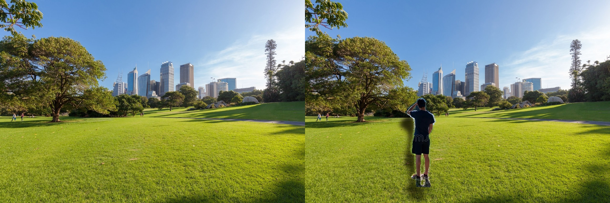

🌟 Realistic Object Blending with Shadows using Light Direction
This project demonstrates an automated pipeline for realistic object compositing—seamlessly integrating a foreground object onto a background image with depth-aware shadows and light direction estimation.

📸 Sample Output

  

🎯 Objective
Blend a person/object into a background image such that:

The background is removed from the object.

Light direction is estimated automatically.

Shadows are generated realistically using depth and light info.

Object lighting is adjusted to match the background.

🧠 Key Features
✅ Background removal using rembg

✅ Shadow-aware object blending using light direction

✅ Light direction estimation from background

✅ Depth-aware shadow displacement using MiDaS

✅ Realistic shadow softness using Gaussian blur

✅ Automatic lighting adjustment on the object

🧰 Technologies Used
Tool/Library	Purpose
Python	Core scripting
OpenCV	Image processing
NumPy	Numerical ops
Pillow (PIL)	Image I/O
rembg	Background removal
PyTorch + Torchvision	Depth estimation using MiDaS
MiDaS	Monocular depth prediction model
OS	File handling

🗂️ Project Structure
graphql
Copy
Edit
.
├── input/
│   ├── obj.jpg           # Input object image
│   ├── obj_mask.png      # Generated binary mask
│   └── output.png        # Transparent PNG after background removal
├── generate_mask.py      # Removes BG and creates mask
├── generate_shadow_output.py  # Final composition pipeline
├── location.py           # Light direction estimation
├── bg.jpg                # Background image
├── enhanced_shadow_result.jpg  # Final output
└── comparison.jpg        # Side-by-side comparison
🛠️ How It Works
1. Background Removal
Script: generate_mask.py

Uses rembg to isolate the object.

Converts alpha channel to a binary mask.

Refines mask using Gaussian blur and threshold.

bash
Copy
Edit
python generate_mask.py
2. Light Direction Estimation
Script: location.py

Converts background to grayscale.

Detects brightest region to estimate light source.

Returns a normalized vector (dx, dy).

python
Copy
Edit
direction = detect_brightest_direction(bg_img)
3. Depth Estimation
Script: generate_shadow_output.py → estimate_depth(img)

Uses MiDaS (DPT_Large) via PyTorch Hub.

Generates a normalized depth map.

Adds realism by varying shadow softness and direction with depth.

4. Shadow Creation
Function: create_realistic_shadow(...)

Translates object mask based on light direction.

Adds elliptical ground shadow.

Blurs and darkens shadows based on scene depth.

5. Object Lighting Adjustment
Function: adjust_object_lighting(...)

Applies a lighting gradient on the object using direction vector.

Enhances realism before blending.

6. Final Blending
Function: enhanced_blend_object_shadow(...)

Places the object on background.

Applies shadows and lighting.

Blends all into a final composited output.

bash
Copy
Edit
python generate_shadow_output.py
💡 Output
enhanced_shadow_result.jpg: Final image with realistic object and shadow.

comparison.jpg: Side-by-side view of original background vs final blended image.

📌 Future Enhancements
Indoor/outdoor lighting distinction.

Real-time shadow compositing.

Color tone matching between object and background.

📄 License
This project is for academic and educational use only.
